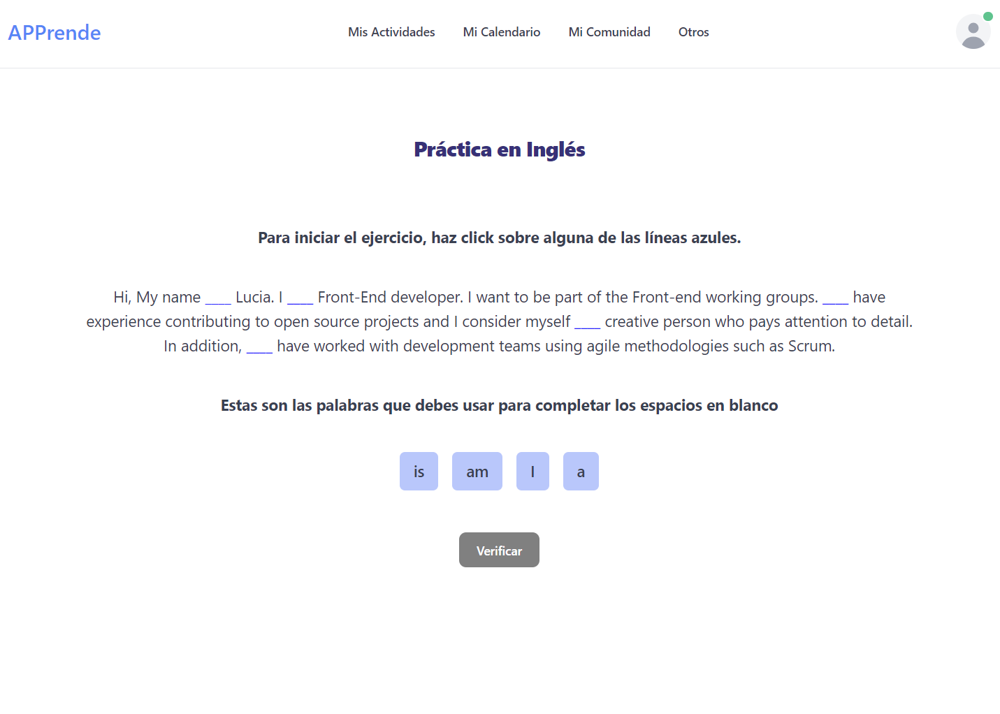

# junior-grupo-frontend

 ## **APPrende**

 Se desarrolla página web con **React** haciendo uso de la librería de código abierto para componentes de interfaz de usuario [**Flowbite**](https://flowbite.com/docs/getting-started/quickstart/) basados en **Tailwind CSS**. Además de incluir algunas funcionalidades utilizando JavaScript.
 
 La página es un prototipo funcional inicial de una plataforma donde los usuarios puedan aprender y practicar un idioma a través de ejercicios. Por el momento para aprender Inglés.

 Enlace a la página: [https://apprende.netlify.app/](https://apprende.netlify.app/)

 
 

 En el desarrollo de la página, se crearon 4 componentes:
 - Mis Actividades
 * Mi Calendario
 + Mi Comunidad
 - Otros

 **Mis Actividades** 
 
 En este componente se desarrolló un ejemplo funcional para practicar inglés. El ejercicio consiste en completar unos espacios en blanco con la palabra correcta. _Ej:_ **Hi, My name ___ Lucia**. 
 
 Una vez el usuario hace clic en el espacio en blanco, se le muestran las palabras opcionales para completar dicho espacio. En este caso la palabra correcta es **“is”**. Una vez finalizado el ejercicio, se le muestra al usuario la cantidad de aciertos que obtuvo y tiene la posibilidad de corregir las que no haya acertado.

 **Mi Calendario** 
 
 Este componente muestra un calendario con hora y descripción de la actividad. Acá el usuario revisa cuales son las actividades que tiene programadas, como por ejemplo clases, prácticas con otras personas, exámenes a realizar, entre otras.

 **Mi Comunidad** 
 
 Este componente muestra un listado de los contactos que tiene el usuario, se muestra un avatar como imagen, también se muestra el rol de la persona (_profesor, compañero de prácticas, grupos, etc_) y sus redes de comunicación en íconos.

 **Otros** 
 
 En este componente se muestran los servicios a los cuales el usuario puede acceder. Se da una descripción del servicio y su costo junto con la opción de adquirirlo.

 > [!NOTE]
 > En este prototipo se asume que el usuario ha iniciado su sesión y se encuentra en un estado de _"disponible"_.

 
## **Contribuciones al proyecto**

 Se crearon dos [issues](https://github.com/luquiceno/junior-grupo-frontend/issues) para la rama _collaboration_. 
 
 El compañero [Sergio Carrascal](https://github.com/scsanchez) contribuyó en mi proyecto resolviendo la issue sobre [Mostrar información en los enlaces del Footer](https://github.com/luquiceno/junior-grupo-frontend/pull/5).
 Para dar solución a la issue el compañero debió crear un componente nuevo llamado _“Contact”_, donde se añadió un formulario, para que el usuario puede ingresar su correo y escribir un mensaje. También debió modificar el componente _Footer_ y _App_ para integrar la nueva ruta y componente creado.
 
 El formulario creado se despliega una vez el usuario hace clic en el enlace _“Contáctanos”_ del componente _Footer_.
 
 Como requisito de solución de la issue, se solicitó hacer uso de los componentes de interfaz de usuario de la librería **Flowbite**, asegurando un estilo coherente con el resto de la página.
 Una vez comprobados los cambios sugeridos por el compañero se procedió a cerrar la pull request.

## **Por qué debería hacer parte de los grupos de trabajo Frontend?**

 Considero que debería ser seleccionada para los grupos de trabajo Frontend, porque aunque no tenga experiencia en el rol como desarrolladora Frontend, cuento con [experiencia laboral](https://www.linkedin.com/in/lucia-mejiaq-frontend-developer/) donde pude trabajar de cerca con equipos de desarrollo o equipos en general, construyendo habilidades que podrían ser transferidas a los grupos de trabajo tales como: colaboración, comunicación, adaptación, cumplimiento, entre otras. 
 
 En este nuevo rol como desarrolladora Frontend he sido autodidacta, he empezado proyectos desde cero o he contribuido a [proyectos](https://github.com/luquiceno/perfcompareBeta/commits?author=luquiceno) de código abierto que se encuentran en marcha. 
 
 Me considero una persona creativa y que me gusta prestar atención al detalle, pero sé que también hay mucho por aprender y ésta sería una gran oportunidad para conocer otras personas con el mismo rol o diferente y de quienes pueda aprender y yo también compartir lo que he aprendido.
 
 He creado o trabajado en proyectos donde debo aplicar conocimientos en **HTML**, **CSS**, **JavaScript**, **Material UI**, **React**, **TypeScript**, **Figma**, **Tailwind CSS**, **Git**, **Github** entre otras habilidades técnicas. Además de conocer como es trabajar usando metodologías ágiles como Scrum.
 
 Espero acompañarlos en este reto y que aprendamos bastante. Muchas gracias.

 ## **Ejecutar la aplicación**

 * Fork/Clone del repositorio
 
     git clone https://github.com/luquiceno/junior-grupo-frontend.git

 * Instalar la carpeta node modules

     npm install
 
 **Dependencias del proyecto**

 La estructura del proyecto fue creado utilizando Vite React: https://vitejs.dev/guide/

 *  react-dom
 *  react-router-dom
 *  Flowbite: librería de código abierto para componentes UI

    https://flowbite.com/docs/getting-started/quickstart/

 *  Flowbite requiere instalar también

    Node.js  https://nodejs.org/en/

    Tailwind CSS  https://tailwindcss.com/docs/installation

 *  Flowbite React

    https://flowbite-react.com/docs/getting-started/introduction

*   Para ejecutar la aplicación localmente

    npm run dev
