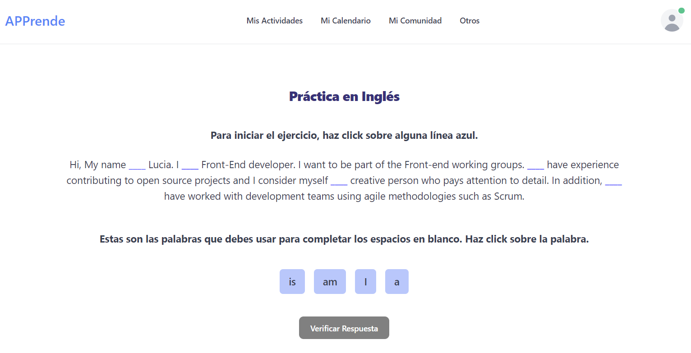

# junior-grupo-frontend
 Repositorio creado como parte del proceso de selección para el grupo frontend de adopta un junior.

 Se desarrolla página web con **React** incluyendo componentes de interfaz de usuario de **Flowbite** basados en **Tailwind CSS**. Además de incluir algunas funcionalidades utilizando JavaScript.
 
 La página es un prototipo funcional inicial de una plataforma, donde los usuarios puedan aprender y practicar un idioma a través de ejercicios.

 

 **EJECUTAR LA APLICACIÓN**

 * Clonar el repositorio
 
     git clone https://github.com/luquiceno/junior-grupo-frontend.git

 * Instalar la carpeta node modules

     npm install
 
 **DEPENDENCIAS DEL PROYECTO**

 La estructura del proyecto fue creado utilizando Vite React: https://vitejs.dev/guide/

 *  react-dom
 *  react-router-dom
 *  Flowbite: librería de código abierto para componentes UI

    https://flowbite.com/docs/getting-started/quickstart/

 *  Flowbite requiere instalar también

    Node.js  https://nodejs.org/en/

    Tailwind CSS  https://tailwindcss.com/docs/installation

 *  Flowbite React

    https://flowbite-react.com/docs/getting-started/introduction

*   Para ejecutar la aplicación localmente

    npm run dev
